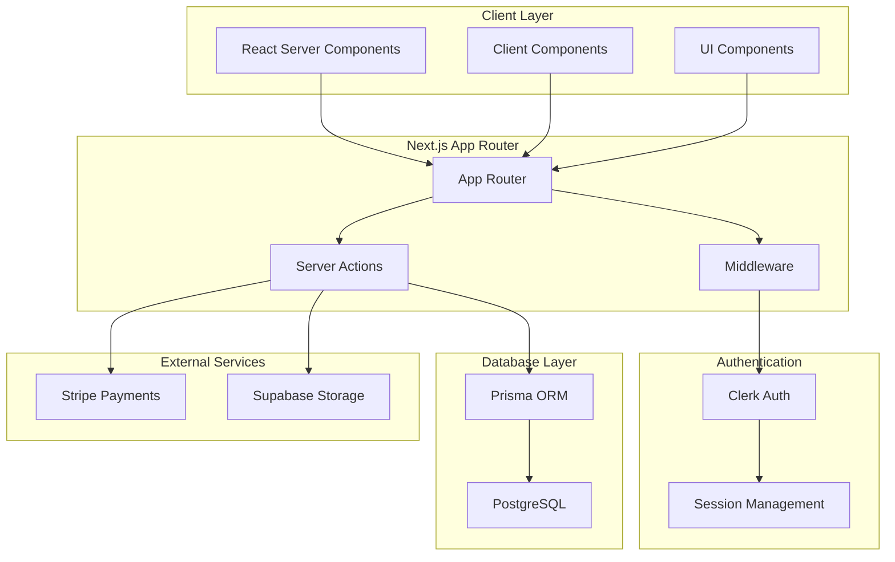
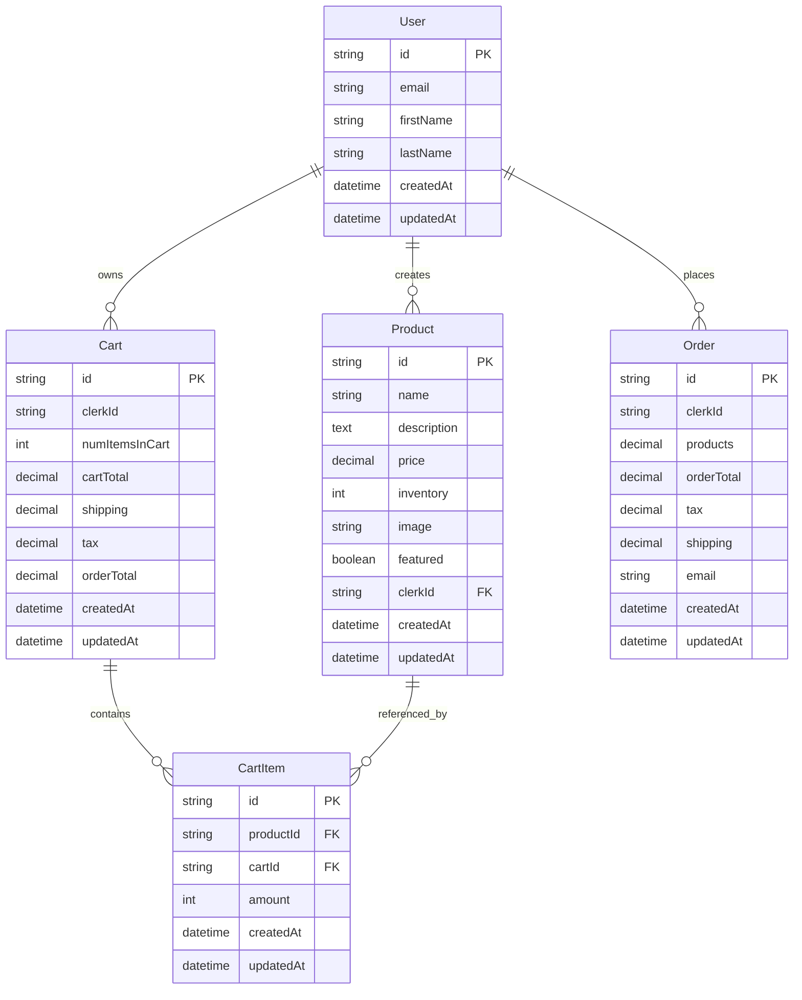
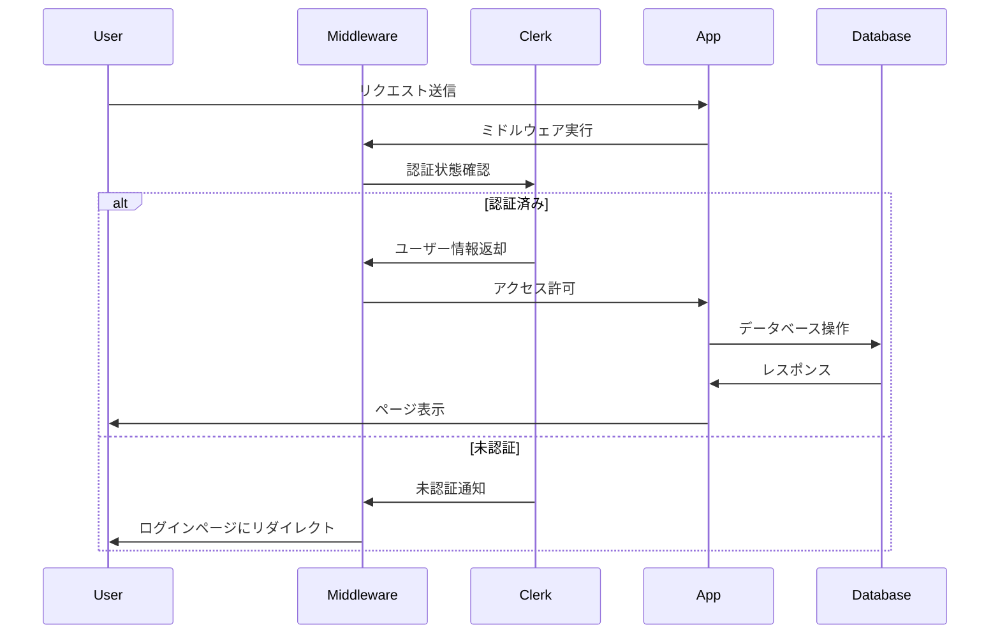

# Next.js Store システム概要

## **概要**

この文書では、Next.js Eコマースアプリケーションの包括的な概要を提供し、そのアーキテクチャ、コアシステム、および主要コンポーネントについて説明します。このシステムは、商品カタログ管理、ショッピングカート機能、ユーザー認証、決済処理、および管理機能を備えたフルスタックオンラインストアです。

この概要では、高レベルのシステム設計とアーキテクチャの決定に焦点を当てています。

---

## **システムの目的とアーキテクチャ**

Next.js Storeは、Next.js 14のApp Routerアーキテクチャを使用して構築された現代的なEコマースプラットフォームです。システムは、サーバーアクション中心の設計を実装し、ビジネスロジックをサーバー関数に集約することで、クライアントとサーバー層間でタイプセーフな操作を提供しています。

### システムアーキテクチャ図



---

## **技術スタック**

このアプリケーションは、パフォーマンスと開発者エクスペリエンスに最適化された現代的なTypeScriptベースのスタックを活用しています：

| **カテゴリ** | **技術** | **目的** |
|--------------|----------|----------|
| **フレームワーク** | Next.js 14 | App Router、Server Actions、SSR |
| **データベース** | PostgreSQL + Prisma | タイプセーフなORMによるデータ永続化 |
| **認証** | Clerk | ユーザー管理とセッション処理 |
| **決済** | Stripe | 決済処理とチェックアウト |
| **ファイルストレージ** | Supabase | 画像アップロードとストレージ |
| **UIフレームワーク** | React 18 + Radix UI | コンポーネントライブラリとプリミティブ |
| **スタイリング** | Tailwind CSS | ユーティリティファーストCSSフレームワーク |
| **バリデーション** | Zod | ランタイム型チェックとバリデーション |

---

## **コアアプリケーション構造**

アプリケーションは、関心の明確な分離を伴うNext.js 14 App Router規約に従っています：

### ディレクトリ構造図

```
Next-Store/
├── app/                    # App Router pages
│   ├── layout.tsx         # Root layout
│   ├── page.tsx          # Home page
│   ├── auth/             # Authentication pages
│   ├── products/         # Product pages
│   ├── cart/            # Shopping cart
│   └── admin/           # Admin dashboard
├── components/           # Reusable UI components
├── utils/
│   ├── actions.ts       # Server actions
│   ├── schemas.ts       # Zod validation schemas
│   └── db.ts           # Database utilities
├── prisma/
│   └── schema.prisma   # Database schema
├── middleware.ts        # Auth & routing middleware
└── package.json
```

### データベーススキーマ図



---

## **認証とセキュリティアーキテクチャ**

システムは、認証にClerkを使用し、認可にカスタムミドルウェアを使用した包括的なセキュリティモデルを実装しています：

### 認証フロー図



### セキュリティ層

1. **ミドルウェアレベル**: 全ルートでの認証チェック
2. **サーバーアクションレベル**: 認可チェックと入力バリデーション
3. **データベースレベル**: 適切な外部キー制約とカスケード削除

---

## **データフローとバリデーションパイプライン**

アプリケーションは、サーバーアクションと統合されたZodスキーマを使用した堅牢なデータバリデーションシステムを実装しています：

### データフロー図

```mermaid
graph LR
    subgraph "Client Side"
        A[Form Input]
        B[Form Submission]
    end
    
    subgraph "Validation Pipeline"
        C[Zod Schema Validation]
        D[Type Checking]
        E[Business Rules]
    end
    
    subgraph "Server Actions"
        F[Authentication Check]
        G[Authorization Check]
        H[Database Operation]
    end
    
    subgraph "Database"
        I[PostgreSQL]
        J[Prisma Validation]
    end
    
    A --> B
    B --> C
    C --> D
    D --> E
    E --> F
    F --> G
    G --> H
    H --> J
    J --> I
    
    style C fill:#e1f5fe
    style F fill:#fff3e0
    style H fill:#f3e5f5
```



### バリデーション層

1. **クライアント側**: フォーム入力の即座なフィードバック
2. **Zodスキーマ**: サーバー側でのランタイム型チェック
3. **ビジネスロジック**: アプリケーション固有のルールと制約
4. **データベース**: スキーマレベルでの制約とバリデーション

---

## **主要なアーキテクチャパターン**

### **1. サーバーファーストアーキテクチャ**

アプリケーションは、ビジネスロジックをサーバーアクション（`utils/actions.ts`）に集約し、タイプセーフな操作を提供し、個別のAPIルートの必要性を排除しています。このパターンにより、データの一貫性が保証され、クライアント・サーバー境界が簡素化されます。

```typescript
// Server Action の例
export async function createProduct(prevState: any, formData: FormData) {
  const user = await getAuthUser();
  
  try {
    const rawData = Object.fromEntries(formData);
    const validatedFields = productSchema.parse(rawData);
    
    await db.product.create({
      data: {
        ...validatedFields,
        clerkId: user.id,
      },
    });
  } catch (error) {
    return renderError(error);
  }
  
  redirect('/admin/products');
}
```

### **2. データベーススキーマ設計**

Prismaスキーマ（`prisma/schema.prisma`）は、適切な外部キー関係、カスケード削除、および監査タイムスタンプを持つ正規化された関係設計を実装し、完全なEコマース機能セットをサポートしています。

### **3. ミドルウェアベースのセキュリティ**

認証と認可は、Next.jsミドルウェア（`middleware.ts`）を使用してエッジで処理され、個別のページで認証ロジックを重複させることなく、すべてのルートで一貫したセキュリティを提供しています。

### **4. コンポーネント・アクション統合**

React Server Componentsは、サーバーアクションとシームレスに統合され、完全なTypeScript安全性を維持しながら、クライアント側APIコールなしでフォーム送信とデータ変更を可能にしています。

---

## **パフォーマンス最適化**

### **1. サーバーサイドレンダリング (SSR)**
- 初期ページロードの高速化
- SEO最適化
- メタデータの動的生成

### **2. 静的生成とキャッシュ**
- 静的コンテンツの事前生成
- CDNによるアセット配信
- データベースクエリのキャッシュ

### **3. 画像最適化**
- Next.js Image コンポーネントによる自動最適化
- WebP形式への変換
- レスポンシブ画像の生成

---

## **開発とデプロイメント**

### **開発環境セットアップ**

```bash
# 依存関係のインストール
bun install

# 環境変数の設定
cp .env.example .env.local

# データベースのマイグレーション
bunx prisma migrate dev

# 開発サーバーの起動
bun dev
```

### **本番環境デプロイ**
- Vercel プラットフォームでの自動デプロイ
- PostgreSQL データベースの設定
- 環境変数の本番環境での設定
- Stripe Webhook の設定

---

## **監視と保守**

### **エラーハンドリング**
- カスタムエラーページ
- サーバーアクションでの統一されたエラーハンドリング
- ユーザーフレンドリーなエラーメッセージ

### **ログとモニタリング**
- アプリケーションレベルのロギング
- データベースクエリの監視
- パフォーマンスメトリクスの追跡

### **セキュリティ監査**
- 定期的な依存関係の更新
- セキュリティ脆弱性のスキャン
- データ保護とプライバシー遵守

---

## **今後の拡張計画**

### **機能拡張**
- 多言語サポート
- モバイルアプリケーション
- AI駆動の商品推薦システム

### **技術的改善**
- マイクロサービスアーキテクチャへの移行
- リアルタイム機能の追加
- 高度な分析とレポート機能

---

## **まとめ**

Next.js Storeは、現代的な技術スタックと設計パターンを活用した堅牢で拡張可能なEコマースプラットフォームです。サーバーアクション中心のアーキテクチャ、包括的なセキュリティモデル、そして効率的なデータフローにより、高性能で保守性の高いアプリケーションを実現しています。
